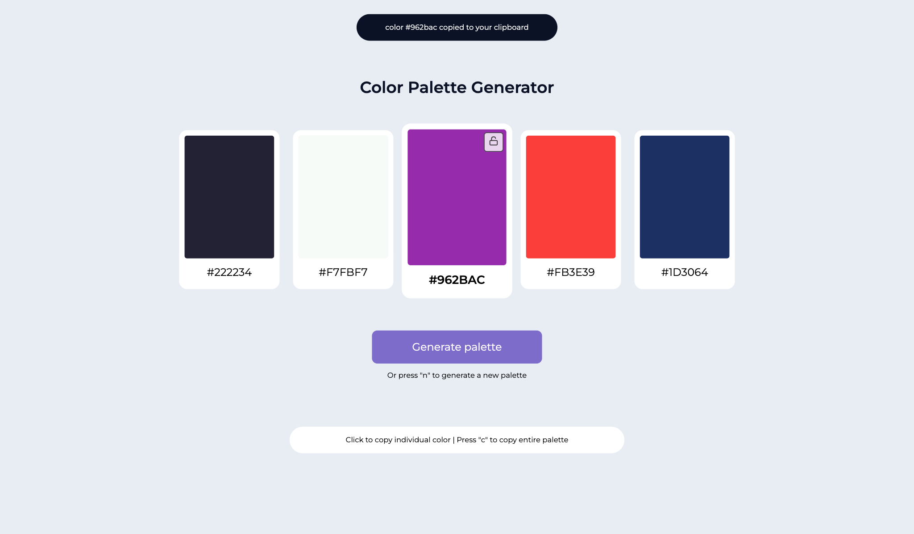
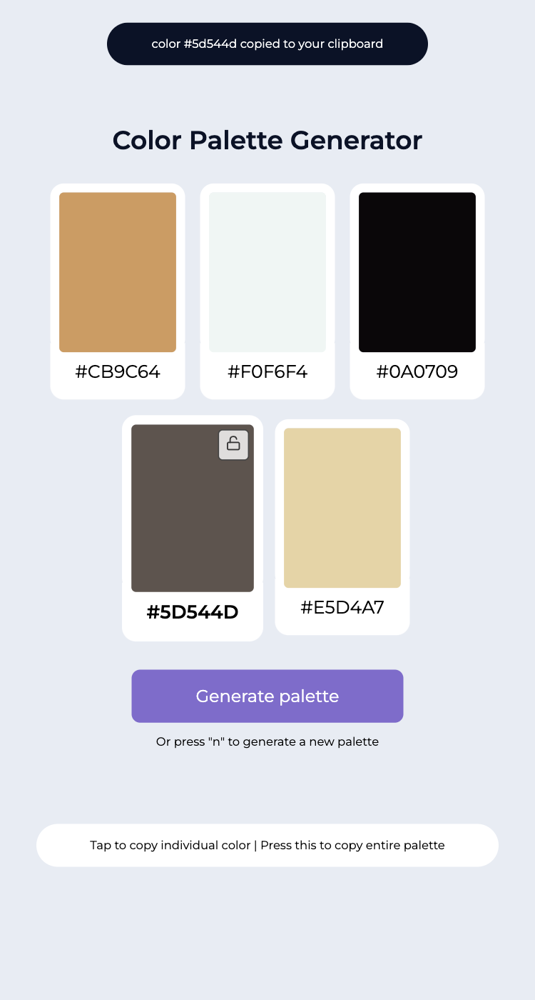

# Random color palette generator

This is an open source project/coding challenge from [DevProjects](http://www.codementor.io/projects). Feedback and questions are welcome!

Find the project requirements here: [Random color palette generator web app](https://www.codementor.io/projects/web/random-color-palette-generator-web-app-ccdljvurh6)

## Tech/framework used
Built with HTML/CSS and JavaScript

Palette generating API: [Huemint](https://huemint.com/about#:~:text=)

## Screenshots
Desktop:

Mobile:

## Instructions for use and keyboard shortcuts

| Action                         | Mobile                           | Desktop                                                |
|--------------------------------|----------------------------------|--------------------------------------------------------|
| Generate new palette           | press generate button            | click on generate button or press "n" on keyboard      |
| Copy individual color code     | tap on color card                | click on color card or press enter/space when focused  |
| Copy palette                   | press copy button at the bottom  | press "c" on keyboard                                  |
| Lock/keep color in next palette| press lock button for that color | click on lock button or press enter/space when focused |

All interactive elements are tab-focusable and keyboard-only friendly, on both mobile and desktop.